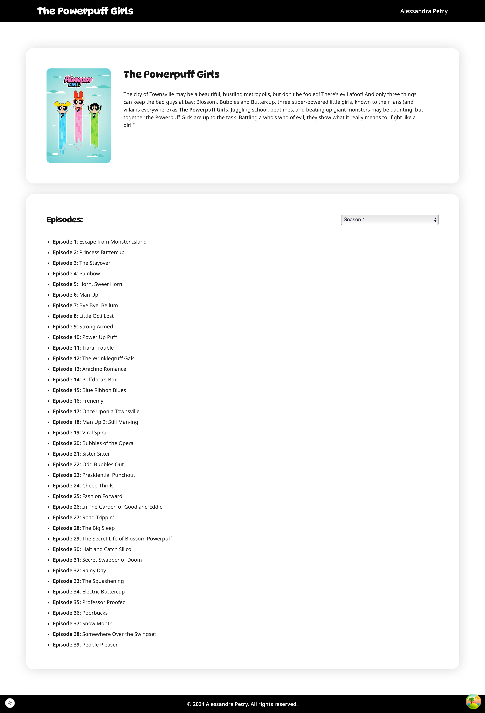
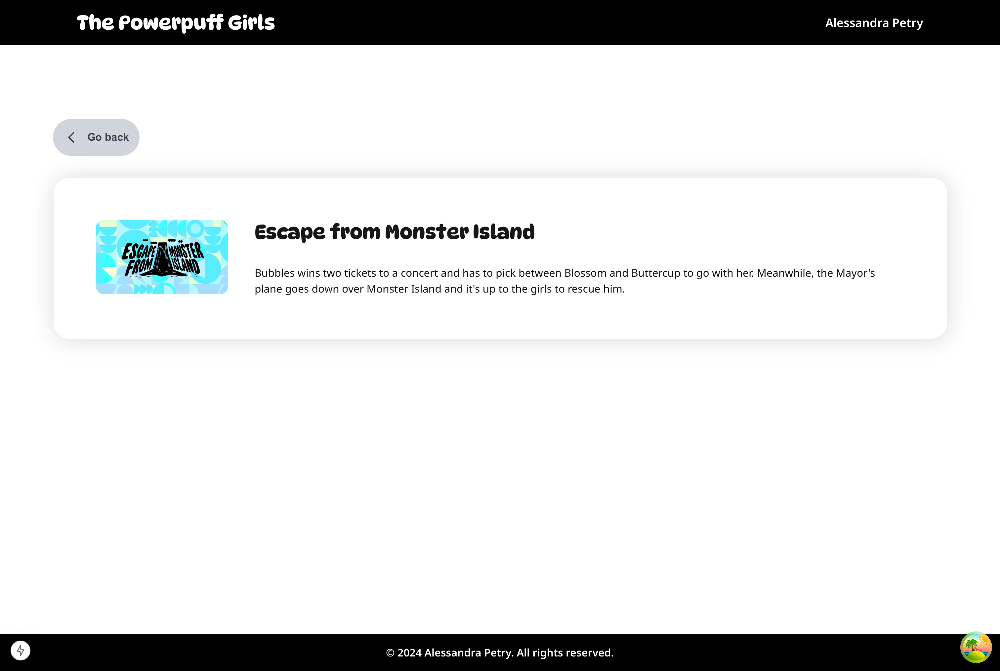

# The Powerpuff Girls

This project belongs to: **Alessandra Petry**

## Contents:
- [The Powerpuff Girls](#the-powerpuff-girls)
  - [Contents:](#contents)
  - [Description:](#description)
  - [Technologies:](#technologies)
  - [Pre requirements:](#pre-requirements)
  - [Instalation Guide:](#instalation-guide)
  - [Usage:](#usage)
  - [Screenshots of the application:](#screenshots-of-the-application)
  - [Production:](#production)

## Description:
Create a web-based application using NextJS, React and TypeScript to display information about the TV show: The Powerpuff Girls. The tv maze API endpoint being used is: https://api.tvmaze.com/shows/6771.
The application contains two (2) pages:
- Show detailed information
- Episode detailed information

## Technologies:
This project is built using the following technologies:
- **NextJS:** 15.0.2
- **React:** ^18.3.1
- **React Query:** ^5.59.20
- **Typescript:** ^5
- **Zustand:** ^5.0.1
- **Tailwind:** ^3.4.1
- **Jest:** ^29.7.0
- **ESLint:** ^8

## Pre requirements:
To run the project it's necessary to have already installed:
- **Node:** v20.11.1
- **Npm:** v10.9.0

## Instalation Guide:
To get started with the project, follow these steps:

Install dependencies: Make sure you have Node.js installed, then run:
```bash
  npm install
```

Start the development server:
```bash
  npm run dev
```

The application should be available at http://localhost:3000

## Usage:
The application is straightforward, when loading the application you can see the show detailed page where you will be able to see the show title, the summary of it and the cover image of the show along with a list of episodes organized by season.

Clicking on an episode will take you to a page with the episode's details. To go back to the main page, you can click on the `Go back` button.

For a smoother experience, the app is designed to make API requests on the server, helping everything load faster and more efficiently.

## Screenshots of the application:
*Home page (show detailed page):*



---

*Episode detailed page:*



## Production:

The application is also deployed on Vercel, so you can check it out without running it locally. Just use the link below:

https://tv-maze-show-weld.vercel.app/
